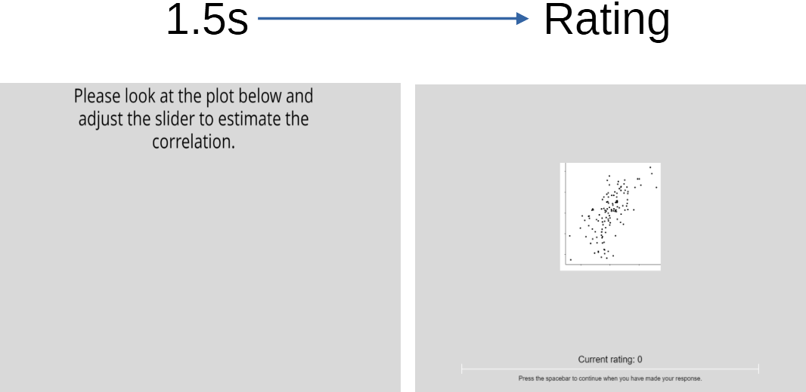
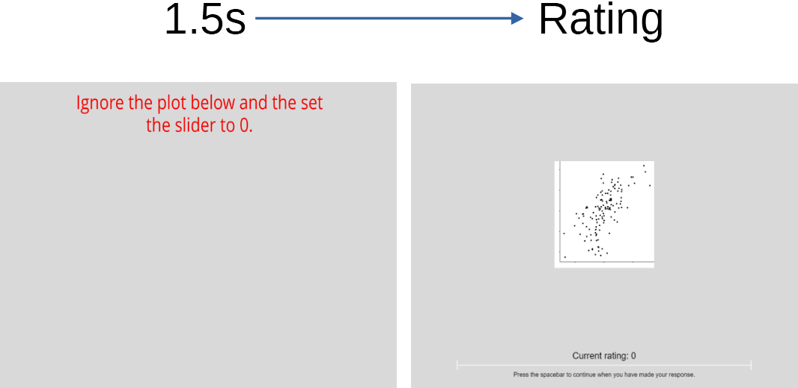

```{r setup, include=FALSE}
knitr::opts_chunk$set(echo = TRUE)
options(knitr.include_graphics.ext = TRUE)
```

# Performance on Correlation Estimation is Better on Larger Plots. In addition, the Presence of a Novel Contrast Encoding also Improves Performance.

## Plotting the Results

The plots below show subjective correlation performance for Small, Medium, and Large
plots. These sizes corresponded to 63%, 100% and 252% size ratios. We hypothesised
that performance at estimating correlation would be better when the plot was larger.
N = 118, 180 experimental trials per participant (fully repeated measures: all participants
saw all versions of each plot). 

```{r, include = FALSE, warning = FALSE, message =  FALSE}
library(tidyverse)
library(afex)
library(emmeans)
library(lme4)
library(buildmer)
library(gridExtra)
library(MASS)
library(scales)

all_data <- read_csv("data/final_data.csv")

# separate the plots_with_labels column into 3 - item, size (3 levels), and present (2 levels)

separated_data <- 
  all_data %>%
  mutate(plots_with_labels = str_replace(plots_with_labels, pattern = "S", replacement = "-S-")) %>%
  mutate(plots_with_labels = str_replace(plots_with_labels, pattern = "M", replacement = "-M-")) %>%
  mutate(plots_with_labels = str_replace(plots_with_labels, pattern = "L", replacement = "-L-")) %>%
  separate(plots_with_labels, c("item", "size", "present"), sep = "-") %>%
  mutate(present = str_replace(present, pattern = ".png", replacement = "")) %>%
  mutate(item = str_replace(item, pattern = "all_plots/", replacement = "")) %>%
  dplyr::select(c("item", "size", "present", "participant",
           "q1_slider.response", "q2_slider.response",
           "q3_slider.response", "q4_slider.response",
           "q5_slider.response", "res_vec", "unique_item_no",
           "my_rs", "slider.response", "age")) %>%
  filter(unique_item_no < 181)

data_to_analyse <- separated_data  %>%
  mutate(size = as.factor(size)) %>%
  mutate(present = as.factor(present)) %>%
  mutate(difference = my_rs - slider.response) %>%
  filter(!is.na(difference)) %>%
  dplyr::select(-c(q1_slider.response:q5_slider.response))

literacy <- all_data%>%
  filter(!is.na(q1_slider.response)) %>%
  rowwise() %>%
  mutate(literacy = sum(c(q1_slider.response, 
                            q2_slider.response, 
                            q3_slider.response, 
                            q4_slider.response, 
                            q5_slider.response))) %>%
    dplyr::select(participant,
           literacy)

only_those_passed <- inner_join(data_to_analyse, literacy, by = "participant")
```

```{r, echo = FALSE, fig.width= 10, fig.height=3.33}
size_L <- only_those_passed %>%
  filter(size == "L") %>%
  group_by(item) %>%
  summarise(mean_obj = mean(my_rs),
            mean_subj = mean(slider.response), sd_subj = sd(slider.response)) %>%
  ggplot(aes(x = mean_obj, y = mean_subj)) +
  geom_point() +
  stat_smooth(method = "loess",
              se = FALSE) +
  geom_errorbar(aes(ymin = mean_subj-sd_subj, ymax = mean_subj+sd_subj), width = .01, colour = "forestgreen") +
  geom_abline(intercept = 0, slope = 1) +
  xlim(0,1) +
  ylim(0,1) +
  theme_minimal() +
  theme(plot.title = element_text(hjust = 0.5)) +
  labs(x = "Objective Correlation Rating",
       y = "Subjective Correlation",
       title = "Large Plot")

size_M <- only_those_passed %>%
  filter(size == "M") %>%
  group_by(item) %>%
  summarise(mean_obj = mean(my_rs),
            mean_subj = mean(slider.response), sd_subj = sd(slider.response)) %>%
  ggplot(aes(x = mean_obj, y = mean_subj)) +
  geom_point() +
  stat_smooth(method = "loess",
              se = FALSE) +
  geom_errorbar(aes(ymin = mean_subj-sd_subj, ymax = mean_subj+sd_subj), width = .01, colour = "forestgreen") +
  geom_abline(intercept = 0, slope = 1) +
  xlim(0,1) +
  ylim(0,1) +
  theme_minimal() +
  theme(plot.title = element_text(hjust = 0.5)) +
  labs(x = "Objective Correlation Rating",
       y = "Subjective Correlation",
       title = "Medium Plot")
  
size_S <- only_those_passed %>%
  filter(size == "S") %>%
  group_by(item) %>%
  summarise(mean_obj = mean(my_rs),
            mean_subj = mean(slider.response), sd_subj = sd(slider.response)) %>%
  ggplot(aes(x = mean_obj, y = mean_subj)) +
  geom_point() +
  stat_smooth(method = "loess",
              se = FALSE) +
  geom_errorbar(aes(ymin = mean_subj-sd_subj, ymax = mean_subj+sd_subj), width = .01, colour = "forestgreen") +
  geom_abline(intercept = 0, slope = 1) +
  xlim(0,1) +
  ylim(0,1) +
  theme_minimal() +
  theme(plot.title = element_text(hjust = 0.5)) +
  labs(x = "Objective Correlation Rating",
       y = "Subjective Correlation",
       title = "Small Plot")

final_plot <- grid.arrange(size_S, size_M, size_L, ncol = 3, top = "Comparing Correlation Ratings by Plot Size") 
```

The summary statistics for the factor of size are as follows.

```{r, echo = FALSE}
only_those_passed  %>%
  mutate(size = as.factor(size)) %>%
  mutate(present = as.factor(present)) %>%
  mutate(difference = my_rs - slider.response) %>%
  filter(!is.na(size)) %>%
  filter(!is.na(difference)) %>%
  group_by(size) %>%
  summarise(mean = mean(difference), sd = sd(difference))
```

We utilised a novel contrast encoding whereby the contrast of a certain point was 
linearly related to the size of the residual of that point. The presence of this 
contrast encoding was associated with better performance on correlation estimation.
Summary statistics are below the plots.

```{r, echo = FALSE, fig.height=5, fig.width=10}
present <- only_those_passed %>%
  filter(present == "Y") %>%
  group_by(item) %>%
  summarise(mean_obj = mean(my_rs),
            mean_subj = mean(slider.response), sd_subj = sd(slider.response)) %>%
  ggplot(aes(x = mean_obj, y = mean_subj)) +
  geom_point() +
  stat_smooth(method = "loess",
              se = FALSE) +
  geom_errorbar(aes(ymin = mean_subj-sd_subj, ymax = mean_subj+sd_subj), width = .01, colour = "forestgreen") +
  geom_abline(intercept = 0, slope = 1) +
  xlim(0,1) +
  ylim(0,1) +
  theme_minimal() +
  labs(x = "Objective Correlation Rating",
       y = "Subjective Correlation",
       title = "Encoding Present")

absent <- only_those_passed %>%
  filter(present == "N") %>%
  group_by(item) %>%
  summarise(mean_obj = mean(my_rs),
            mean_subj = mean(slider.response), sd_subj = sd(slider.response)) %>%
  ggplot(aes(x = mean_obj, y = mean_subj)) +
  geom_point() +
  stat_smooth(method = "loess",
              se = FALSE) +
  geom_errorbar(aes(ymin = mean_subj-sd_subj, ymax = mean_subj+sd_subj), width = .01, colour = "forestgreen") +
  geom_abline(intercept = 0, slope = 1) +
  xlim(0,1) +
  ylim(0,1) +
  theme_minimal() +
  theme(plot.title = element_text(hjust =0.9)) +
  labs(x = "Objective Correlation Rating",
       y = "Subjective Correlation",
       title = "Encoding Absent")   

final_plot <- grid.arrange(present, absent,ncol = 2, top = "Comparing Correlation Ratings")  
```

```{r, echo = FALSE}
only_those_passed %>%
  mutate(size = as.factor(size)) %>%
  mutate(present = as.factor(present)) %>%
  mutate(difference = my_rs - slider.response) %>%
  filter(!is.na(size)) %>%
  filter(!is.na(difference)) %>%
  group_by(present) %>%
  summarise(mean = mean(difference), sd = sd(difference))
```

# Modelling

## Modelling Main Effects

A Linear Mixed Model was fitted with the **buildmer** package, which begins with
a maximal model and drops terms until it converges and no errors are returned.
The model built had the following syntax;

```
model <- lmer(difference ~ size * present + (1 | participant) + (1 | item))
```

This model has random intercepts for participants and items.

```{r, include = FALSE}
contrasts(only_those_passed$size) = contr.sum(levels(only_those_passed$size))
contrasts(only_those_passed$present) = contr.sum(levels(only_those_passed$present))

model <- lmer(difference ~ size * present +
       (1 | participant) +
       (1 | item),
     data = only_those_passed)

model_null <- lmer(difference ~ 1 +
       (1 | participant) +
       (1 | item),
     data = only_those_passed)

anova(model, model_null)
```

An ANOVA comparing models for participant's difference scores revealed a significant difference 
between estimations of correlation for different levels of the two factors: $\chi^2(5) = 91.91, p <.001$.

There was no effect of an interaction between the two factors. Estimated marginal
means and contrasts for the two factors can be seen below:

```{r, echo=FALSE, warning=FALSE, message=FALSE}
emmeans(model, pairwise ~ size)
emmeans(model, pairwise ~ present)
```

## Modelling with Graph Literacy as a Fixed Effect

Participants also answered a 5-item questionnaire on Subjective Graph Literacy 
(Garcia-Retamero et al., 2016). We build a model with graph literacy as a fixed effect

```{r, include = FALSE}
model_lit <- lmer(difference ~ literacy + size * present +
       (1 | participant) +
       (1 | item),
     data = only_those_passed)

anova(model_lit, model)
```
  
An ANOVA between the model including literacy as a fixed effect and the original 
model reveals no significant effect of graph literacy: $\chi^2=2.33(1), p = 0.13$.

## Modelling with Residuals

As two scatterplots can show the same correlations, but have different point-by-point 
residuals, we can also model to include the sum of the residuals as a predictor.

```{r, include = FALSE}
model_res <- lmer(difference ~ res_vec + size * present +
       (1 | participant) +
       (1 | item),
     data = only_those_passed)

anova(model_res, model)
```

An ANOVA between the model including total residuals as a fixed effect and the original
model reveals no significant effect of total residual size for each plot: $\chi^2(1) = 2.31, p = 0.13$

# Where Next?

## Residual Slopes

The plot below is of the type used in E1. 
```{r, echo = FALSE, warning=FALSE, fig.align='center'}
set.seed(1234)

my_sample_size = 128

my_desired_r = 0.8

mean_variable_1 = 0
sd_variable_1 = 1

mean_variable_2 = 0
sd_variable_2 = 1

mu <- c(mean_variable_1, mean_variable_2) 

myr <- my_desired_r * sqrt(sd_variable_1) * sqrt(sd_variable_2)

mysigma <- matrix(c(sd_variable_1, myr, myr, sd_variable_2), 2, 2) 

corr_data = as_tibble(mvrnorm(my_sample_size, mu, mysigma, empirical = TRUE))

corr_model <- lm(V2 ~ V1, data = corr_data)

my_residuals <- abs(residuals(corr_model))

data_with_resid <- round(cbind(corr_data, my_residuals), 2)

ggplot(data_with_resid, aes(x = V1, y = V2)) +
  geom_point(aes(alpha = -my_residuals))  +
  #geom_smooth(method = "lm", se = FALSE) +
  labs(x = "", y = "") +
  theme_classic() +
  theme(axis.text = element_blank()) +
  theme(legend.position = "None")
```

In this plot, the residuals for each point are linearly scaled between 0 and 1, and those
values are used to set the contrast for each point. We are now interested in varying
the slope of linear scaling in an attempt to fine-tune the contrast encoding effect.
We do this using the ```rescale``` function from the ```scales``` package. 
Below are three plots. 

```{r, echo = FALSE, fig.width= 10, fig.height=3.33}
set.seed(1234)

my_sample_size = 128

my_desired_r = 0.8

mean_variable_1 = 0
sd_variable_1 = 1

mean_variable_2 = 0
sd_variable_2 = 1

mu <- c(mean_variable_1, mean_variable_2) 

myr <- my_desired_r * sqrt(sd_variable_1) * sqrt(sd_variable_2)

mysigma <- matrix(c(sd_variable_1, myr, myr, sd_variable_2), 2, 2) 

corr_data = as_tibble(mvrnorm(my_sample_size, mu, mysigma, empirical = TRUE))

corr_model <- lm(V2 ~ V1, data = corr_data)

my_residuals <- abs(residuals(corr_model))

data_with_resid <- round(cbind(corr_data, my_residuals), 2)

scaled_residuals <- rescale(data_with_resid$my_residuals, 
                            from = range(data_with_resid$my_residuals), 
                            to = c(0, 1)) 
scaled_residuals_low <- scaled_residuals / 1.2
scaled_residuals_high <- scaled_residuals * 1.2


scaled_data <- cbind(data_with_resid, scaled_residuals_low,
                         scaled_residuals_high,
                         scaled_residuals)

s1 <- ggplot(scaled_data, aes(x = V1, y = V2)) +
  scale_alpha_identity() +
  geom_point(aes(alpha = 1-scaled_residuals_low))  +
  #geom_smooth(method = "lm", se = FALSE) +
  labs(x = "", y = "") +
  theme_classic() +
  theme(axis.text = element_blank()) +
  theme(legend.position = "None") +
  labs(title = "Shallow Slope")

s2 <- ggplot(scaled_data, aes(x = V1, y = V2)) +
  scale_alpha_identity() +
  geom_point(aes(alpha = 1-scaled_residuals))  +
  #geom_smooth(method = "lm", se = FALSE) +
  labs(x = "", y = "") +
  theme_classic() +
  theme(axis.text = element_blank()) +
  theme(legend.position = "None") +
  labs(title = "Original Slope")

s3 <- ggplot(scaled_data, aes(x = V1, y = V2)) +
  scale_alpha_identity() +
  geom_point(aes(alpha = 1-scaled_residuals_high))  +
  #geom_smooth(method = "lm", se = FALSE) +
  labs(x = "", y = "") +
  theme_classic() +
  theme(axis.text = element_blank()) +
  theme(legend.position = "None") +
  labs(title = "Steep Slope")

final_plot <- grid.arrange(s1, s2, s3, ncol = 3, top = "Contrast Encoding: Different Slopes") 
```

## Addressing Issues of Data Quality

Despite collecting data from over 260 participants, only 118 remained after rejecting
those who failed the attention checks. These attention checks were confirmed as
fair by the team at prolific.co, but on the whole this made data collection more
difficult and time-consuming than we had originally anticipated. Below are
examples of experimental (left) and attention check (right) trials. 

```{r trial, echo=FALSE, fig.cap="", out.width = "100%", out.height="25%", fig.show='hold', fig.align='center'}
knitr::include_graphics(c("proposed_trial_amendments/trial.png", "proposed_trial_amendments/set_to_1_AC.png"))
```

To address the issues of data quality, I propose we increase the salience of the
attention check trials by conditioning participants to read some text before
they see the plot and set the slider. In the proposed methodology, participants
would see text for each slide *before* the plot was displayed.

```{r new_normal_trial, echo=FALSE, fig.cap="", out.width = "100%", fig.show='hold', fig.align='center'}

```

Below shows the new proposed attention check trials. Red font has been used to 
draw participants' attention.

```{r at_trial, echo=FALSE, fig.cap="", out.width = "100%", fig.show='hold', fig.align='center'}

```


